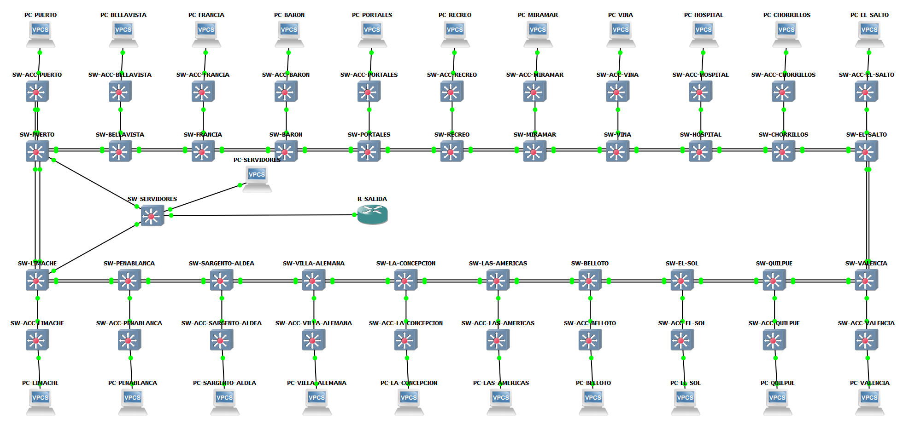

# Actualización del laboratorio - 9 de octubre de 2026

Estado actual de Metro_Valparaiso_Sandbox tras extender EtherChannel a las 21 estaciones: 66 equipos, 89 enlaces físicos, 21 conexiones dobles entre estaciones y 42 Port-channel locales.

## Documentos

- [Implementación v4](Metro_Valparaiso_implementacion_v4.pdf): distribución de puertos, VLAN de tránsito, IP, OSPF, pruebas e inventario.
- [Dispositivos e IP v2](Dispositivos_IP_v2.pdf): 66 dispositivos y detalle de las 262 IP configuradas, incluidas las direcciones antiguas en interfaces apagadas.
- [Inventario CSV para Alex](Dispositivos_IP_v2.csv): IP de administración para SSH y PC de prueba. Las IP SSH y sus credenciales se mantienen.
- [Todas las IP por interfaz](Todas_interfaces_IP_v4.csv).
- [Enlaces EtherChannel](Enlaces_EtherChannel_v4.csv).
- [Informe de migración](EtherChannel_anillo_v4.md).
- [Evidencias de validación](EtherChannel_anillo_validacion.json): estado final tras reinicio, conectividad de 22 PC y 44 IP de administración, pruebas de fallo y verificación del portable.

## Topología actual

## Cambios aplicados

En Distribución: Fa1/1-2 hacia anterior (Po1), Fa1/3-4 hacia siguiente (Po2), Fa1/5 hacia Acceso (Fa1/15). Puerto conserva respaldo de Acceso en Fa1/6 hacia Fa1/14. Fa1/0 queda apagada como reserva.

Cada pareja de estaciones utiliza una VLAN de tránsito exclusiva, de 201 a 221, con SVI /30 en 10.253.0.x. Cada switch de Distribución añade dos VLAN de tránsito a las cinco base; VLAN 1 existe por defecto. Los switches de Acceso mantienen las cinco VLAN base. Los trunks hacia Acceso excluyen 201-221.

OSPF área 0 utiliza SVI de tránsito punto a punto con coste 1. La agrupación es estática mode on, ya que esta imagen IOS no admite LACP. STP permanece activo.

Los 21 cables antiguos entre Fa0/0 y Fa0/1 se retiraron. Sus interfaces quedan apagadas y mantienen las IP antiguas para posible reversión. Los enlaces de servidores y router se conservan.

Se verificaron fallos de un miembro y del grupo completo en Puerto-Bellavista, Quilpué-El Sol y Limache-Puerto. Se exportó y reinició todo el laboratorio; volvieron a funcionar 42 Port-channel, 22 PC y 44 IP de administración. La prueba de administración es de conectividad IP, no una nueva autenticación SSH.

El paquete portable v4 y las configuraciones completas se entregan localmente a Cristopher. Las imágenes IOS, claves privadas y hashes de autenticación no forman parte de esta carpeta.

Los documentos v1-v3 en la raíz del repositorio corresponden a etapas anteriores. Esta carpeta describe el estado actual.
