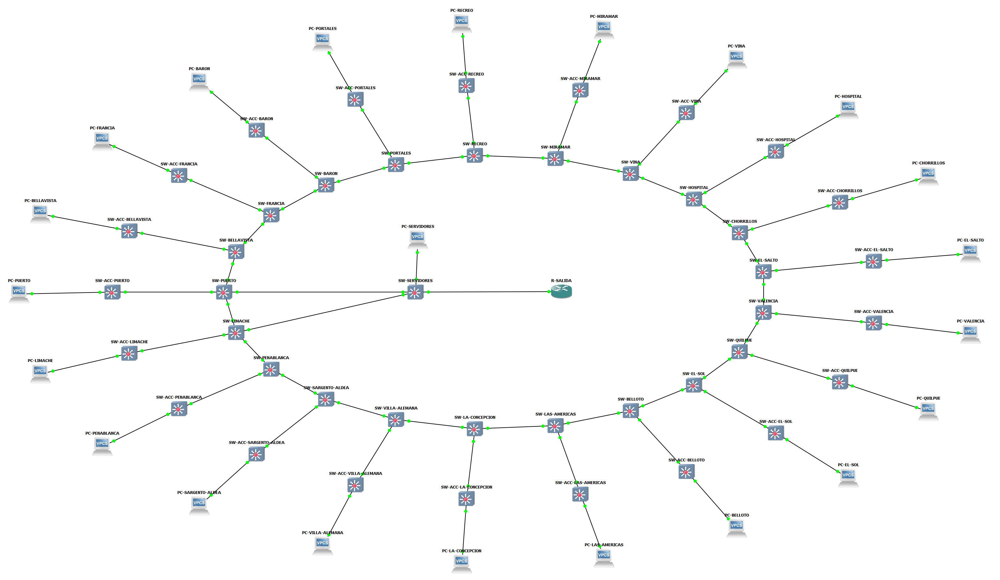

# PrototipadoGalax-ia

Documentación del laboratorio Metro Valparaíso para el desarrollo del bot y sus playbooks. Estado actual: 21 estaciones con Distribución, Acceso y PC; 66 dispositivos, 67 enlaces y direccionamiento estático.

## Documentos

- [Implementación actual v3](Metro_Valparaiso_implementacion_v3.pdf): incluye el inventario de los 66 equipos y las 220 IP configuradas.
- [Dispositivos e IP](Dispositivos_IP_v1.pdf): documento independiente solo con la tabla. También disponible en [CSV](Dispositivos_IP_v1.csv) y [Markdown](Dispositivos_IP_v1.md).
- [Direccionamiento](Metro_Valparaiso_direccionamiento.md), [SSH](Acceso_SSH_y_mejoras.md) y [validación](Resultados_validacion.md).
- [Credenciales del laboratorio](Credenciales_SSH_LAB.txt).

## Topología actual

## Versiones

| Versión | Contenido | Conservación |
|---|---|---|
| v1 | Implementación anterior a agregar switches de Acceso | PDF original recuperado del paquete anterior |
| v2 | Distribución y Acceso en las 21 estaciones; VLAN 99 de gestión | Reconstruido del documento de esa etapa, sin el inventario añadido en v3 |
| v3 | Inventario completo de equipos e IP para el bot | PDF actual |

Versionado documental organizado el 2026-10-07. Las próximas revisiones de implementación usarán v4, v5, etc., conservando los PDF anteriores. El inventario tiene su propia secuencia v1, v2, etc. Mantener un registro de cambios al añadir revisiones.

## Uso por Alex

En la tabla, IP para SSH identifica el destino de ansible_host de los 44 equipos Cisco: TCP 22, usuario botlab, privilegio 15. Los 22 VPCS sirven para pruebas y no ofrecen SSH. La conexión desde el host del bot a la red virtual debe configurarse antes de ejecutar los playbooks; la biblioteca SSH todavía debe comprobarse con los IOS del laboratorio.

Repositorio privado con credenciales de laboratorio, destinado al equipo autorizado. El proyecto GNS3 portable, sus imágenes IOS, sus claves privadas y los archivos de configuración de los equipos se entregan por separado y no forman parte de este repositorio.
